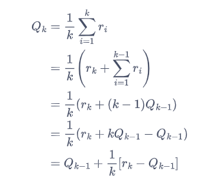
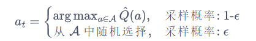

## 相关概念
**懊悔：** 当前动作与有最大期望收益的动作最终得到的奖励差
**累积懊悔：** 多步决策的累积懊悔

## 估计期望奖励的更新方法：

## 多臂老虎机问题中常用策略
设计策略时需要**平衡探索和利用**的次数，使得累积奖励最大化。

**策略1：ϵ-贪心算法**
 ϵ-贪婪算法在完全贪婪算法的基础上添加了噪声，每次以概率**1-ϵ**选择以往经验中**期望奖励估值最大**的那根拉杆（利用），以概率**ϵ**随机选择一根拉杆（探索），公式如下：

随着探索次数的不断增加，我们对各个动作的奖励估计得越来越准，此时我们就没必要继续花大力气进行探索。所以在ϵ-贪婪算法的具体实现中，我们可以**令ϵ随时间衰减**，即**探索的概率将会不断降低**。

**策略2：上置信界算法**
上置信界（upper confidence bound，UCB）算法是一种经典的基于不确定性的策略算法，它的思想用到了一个非常著名的数学原理：霍夫丁不等式。在霍夫丁不等式中，**对于随机变量$X$及$n$个独立同分布样本的平均值$\bar{x}_n$，有：**

**其中$u$为不确定量。**
直观地说，UCB 算法在每次选择拉杆前，**先估计每根拉杆的期望奖励的上界**，使得拉动每根拉杆的期望奖励只有一个**较小的概率**超过这个上界，接着选出**期望奖励上界最大**的拉杆，从而选择最有可能获得最大期望奖励的拉杆。
**详细解释链接：**
https://hrl.boyuai.com/chapter/1/%E5%A4%9A%E8%87%82%E8%80%81%E8%99%8E%E6%9C%BA

**策略3：汤普森采样算法**
汤普森采样算法使用采样的方式，即**根据当前每个动作$a$的奖励概率分布进行一轮采样**，得到一组各根拉杆的奖励**样本**，再选择样本中**奖励最大的动作**。
在实际情况中，我们通常用 Beta 分布对当前每个动作的奖励概率分布进行建模。具体来说，若某拉杆被选择了$k$次，其中$m_1$次奖励为 1，$m_2$ 次奖励为 0，则该拉杆的奖励服从参数为$(m_1,m_2)$ 的 Beta 分布。

