## 相关概念
**1.马尔可夫性质：** 当且仅当某时刻的状态**只取决于上一时刻的状态**时，一个随机过程被称为具有马尔可夫性质。
**2.马尔可夫过程：** 马尔可夫过程（Markov process）指具有马尔可夫性质的随机过程，也被称为马尔可夫链（Markov chain）。**我们通常用元组 $(S,P)$描述一个马尔可夫过程，其中$S$是有限数量的状态集合，$P$是状态转移矩阵(state transition matrix).** 假设一共有$n$个状态，此时$S=\{s_1,s_2,...,s_n\}$。状态转移矩阵$P$定义了所有状态对之间的转移概率，即
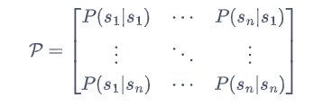

**3.马尔可夫奖励过程:**
在马尔可夫过程的基础上加入奖励函数$r$和折扣因子$\gamma$，就可以得到马尔可夫奖励过程（Markov reward process）。一个马尔可夫奖励过程由$<S,P,r，\gamma>$构成，各个组成元素的含义如下所示。
**$S$是有限状态的集合。**
**$P$是状态转移矩阵。**
**$r$是奖励函数，某个状态$s$的奖励$r(s)$指转移到该状态时可以获得奖励的期望**
**$\gamma$是折扣因子,在0到1之间，较小代表关注短期收益，较大代表关注长期收益。**

**3.1回报：**
在一个马尔可夫奖励过程中，**从第$t$时刻状态$S_t$开始**，直到终止状态时，所有奖励的衰减之和称为回报$G_t$（Return），公式如下:
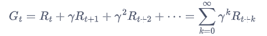
其中，$R_t$表示在时刻$t$获得的奖励。

**3.2价值函数:**
在马尔可夫奖励过程中，**一个状态的期望回报（即从这个状态出发的未来累积奖励的期望）被称为这个状态的价值（value）**。所有状态的价值就组成了价值函数（value function），价值函数的输入为某个状态，输出为这个状态的价值,公式如下：
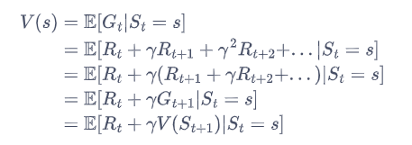
可以根据从状态$s$出发的转移概率得到，即可以得到
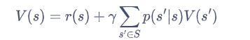
上式就是马尔可夫奖励过程中非常有名的**贝尔曼方程**（Bellman equation），对每一个状态都成立.
我们可以将贝尔曼方程写成**矩阵形式**:
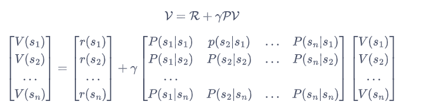

从而得到解析解：
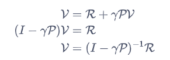

**4.马尔可夫决策过程：**
在马尔可夫奖励过程（MRP）的基础上加入动作，就得到了马尔可夫决策过程（MDP）。马尔可夫决策过程由元组$<S,A,P,r,\gamma>$构成，其中：
$S$是状态的集合；
**$A$是动作的集合；**
$\gamma$是折扣因子；
$r(s,a)$ 是奖励函数，此时奖励可以同时取决于状态和动作，在奖励函数只取决于状态时，则退化为 $r(s)$；
$P(s'|s,a)$是状态转移函数，表示在状态$s$执行动作$a$之后到达状态$s'$的概率;
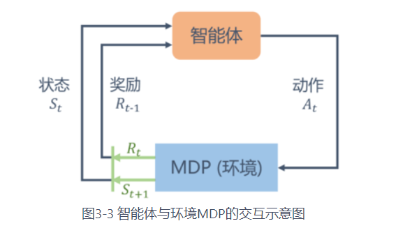

**4.1策略:**
智能体的策略（Policy）通常用字母$\pi$表示。策略$\pi(a|s)=P(A_t=a|s_t=s)$是一个函数，**表示在输入状态$s$情况下采取动作$a$的概率**。当一个策略是确定性策略（deterministic policy）时，它在每个状态时只输出一个确定性的动作，即只有该动作的概率为 1，其他动作的概率为 0；当一个策略是随机性策略（stochastic policy）时，它在每个状态时输出的是关于动作的**概率分布**，然后**根据该分布进行采样**就可以得到一个动作。

**4.2状态价值函数：**
我们用$V^{\pi}(s)$表示在 MDP 中基于策略$\pi$的状态价值函数（state-value function），定义为从状态$s$出发遵循策略$\pi$能获得的期望回报，数学表达为：
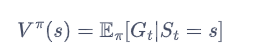

**4.3动作价值函数：**
不同于 MRP，在 MDP 中，由于动作的存在，我们额外定义一个动作价值函数（action-value function）。我们用$Q^{\pi}(s,a)$表示在 MDP 遵循策略$\pi$时，对当前状态$s$执行动作$a$得到的期望回报：
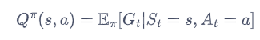

**状态价值函数和动作价值函数之间的关系:**
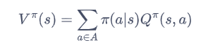
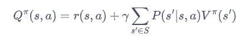

**4.4贝尔曼期望方程：**
我们通过简单推导就可以分别得到两个价值函数的贝尔曼期望方程（Bellman Expectation Equation）：
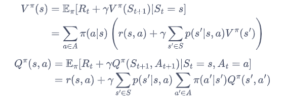

**4.5贝尔曼最优方程：**
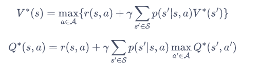

**4.6蒙特卡洛方法估计状态价值函数。**
一个状态的价值是它的期望回报，那么一个很直观的想法就是用策略在 MDP 上采样很多条序列，计算从这个状态出发的回报再求其期望就可以了，公式如下：
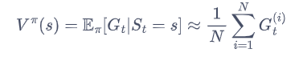

计算状态价值的具体过程如下所示。
(1) 使用策略采样若干条序列：
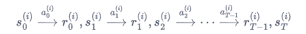
(2) 对每一条序列中的每一时间步的状态进行以下操作：
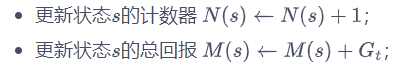
(3) 每一个状态的价值被估计为回报的平均值 
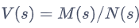
