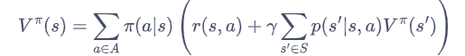
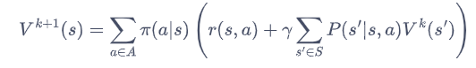
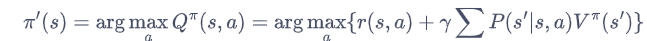
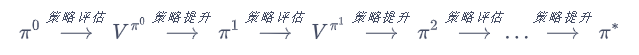
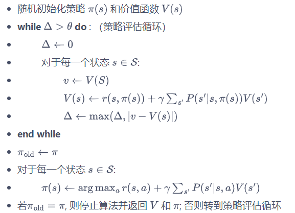
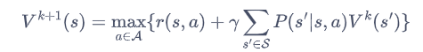
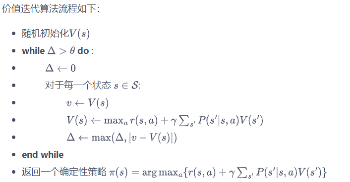

## 1.算法介绍
**基于动态规划的强化学习算法**主要有两种：一是**策略迭代**（policy iteration），二是**价值迭代**（value iteration）。其中，策略迭代由两部分组成：**策略评估**（policy evaluation）和**策略提升**（policy improvement）。具体来说，**策略迭代中的策略评估使用贝尔曼期望方程来得到一个策略的状态价值函数，这是一个动态规划的过程**；而**价值迭代直接使用贝尔曼最优方程来进行动态规划，得到最终的最优状态价值**。

#### 1.1策略评估：
策略评估这一过程用来计算一个策略的**状态价值函数**。
回顾一下之前学习的贝尔曼期望方程：

其中，$\pi(a|s)$是策略在状态$s$下采取动作$a$的概率。
可以看到，当知道奖励函数和状态转移函数时，我们可以根据下一个状态的价值来计算当前状态的价值。因此，**根据动态规划的思想，可以把计算下一个可能状态的价值当成一个子问题**，把计算当前状态的价值看作当前问题。**在得知子问题的解后，就可以求解当前问题**。更一般的，**考虑所有的状态，就变成了用上一轮的状态价值函数来计算当前这一轮的状态价值函数**，即

**事实上，可以证明当k足够大时，状态价值函数会收敛**。

#### 1.2策略提升：

使用策略评估计算得到当前策略的状态价值函数之后，我们可以据此来改进该策略。假设此时对于策略$\pi$，我们已经知道其价值$V^{\pi}$，我们可以直接贪心地在每一个状态选择动作价值最大的动作，也就是

#### 1.3策略迭代算法
总体来说，策略迭代算法的过程如下：**对当前的策略进行策略评估，得到其状态价值函数，然后根据该状态价值函数进行策略提升以得到一个更好的新策略**，接着继续评估新策略、提升策略……直至最后收敛到最优策略.

结合策略评估和策略提升，我们得到以下策略迭代算法：

#### 1.4价值迭代算法
策略迭代中的策略评估需要进行很多轮才能收敛得到某一策略的状态函数，我们可以**只在策略评估中进行一轮价值更新，然后直接根据更新后的价值进行策略提升。**
需要注意的是，价值迭代中不存在显式的策略，我们只维护一个状态价值函数。

迭代更新的方式为：

