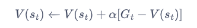
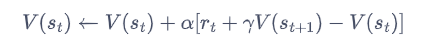
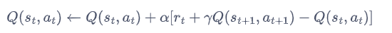
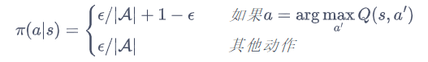
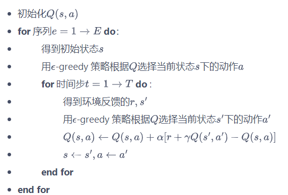
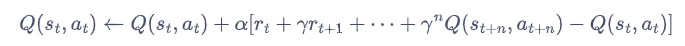
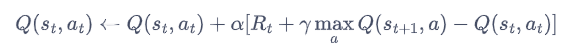
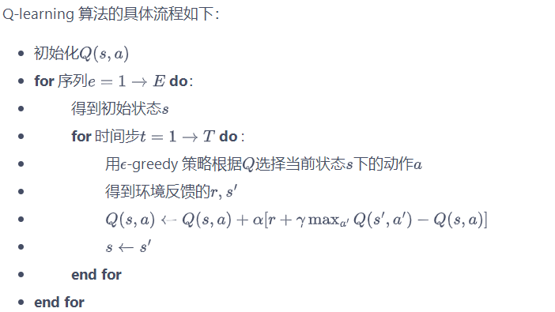
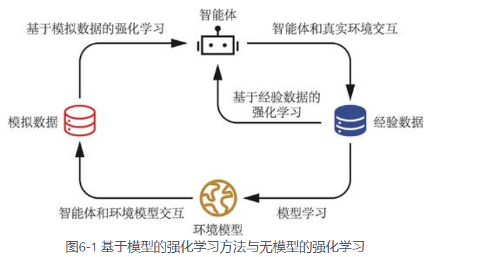
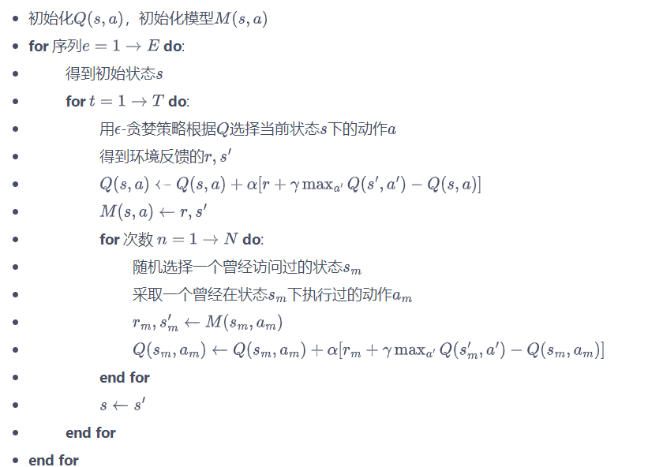

## 1.相关概念介绍
**无模型强化学习：**
智能体只能和环境进行交互，通过采样到的数据来学习，这类学习方法统称为无模型的强化学习（model-free reinforcement learning）。
无模型的强化学习算法不需要事先知道环境的奖励函数和状态转移函数，而是**直接使用和环境交互的过程中采样到的数据来学习**，这使得它可以被应用到一些简单的实际场景中。

## 2.算法介绍

#### 2.1时序差分方法
**时序差分是一种用来估计一个策略的价值函数的方法**。
蒙特卡洛方法对价值函数的**增量更新方式**：

这里我们将$\frac{1}{N_t}$替换成了$\alpha$，$\alpha$表示对价值估计更新的步长,也可看做学习率。可以将取为一个常数，**此时更新方式不再像蒙特卡洛方法那样严格地取期望**。

蒙特卡洛方法必须要等整个序列结束之后才能计算得到这一次的回报，而**时序差分方法只需要当前步结束即可进行计算**。具体来说，时序差分算法**用当前获得的奖励加上下一个状态的价值估计来作为在当前状态会获得的回报**，即：

#### 2.2 Sarsa算法
Sarsa算法用类似策略迭代的方法来进行强化学习。
直接用时序差分算法来估计动作价值函数$Q$：

策略迭代采用一个$\epsilon$-贪婪策略:有$1-\epsilon$的概率采用动作价值最大的那个动作，另外有$\epsilon$的概率从动作空间中随机采取一个动作，其公式表示为：

Sarsa 的具体算法如下：

#### 2.3多步 Sarsa 算法
多步时序差分的意思是使用$n$步的奖励，然后使用之后状态的价值估计。

#### 2.4 Q-learning 算法
Q-learning 和 Sarsa 的最大区别在于 Q-learning 的时序差分更新方式为:

Q-learning的思想类似于价值迭代，使用贝尔曼最优方程来更新动作价值函数。

#### 2.5在线策略与离线策略
我们称**采样数据**的策略为**行为策略**（behavior policy），称**用这些数据来更新**的策略为**目标策略**（target policy）。在线策略（on-policy）算法表示**行为策略和目标策略是同一个策略**；而离线策略（off-policy）算法表示行为策略和目标策略不是同一个策略。Sarsa 是典型的在线策略算法，而 **Q-learning 是典型的离线策略算法**。

#### 2.6 Dyna-Q 算法
Dyna-Q 算法是非常基础的基于模型的强化学习算法，不过**它的环境模型是通过采样数据估计得到的**。

Dyna-Q 使用一种叫做 Q-planning 的方法来基于模型生成一些模拟数据，然后用模拟数据和真实数据一起改进策略。Q-planning 每次选取一个曾经访问过的状态$s$，采取一个曾经在该状态下执行过的动作$a$，通过模型得到转移后的状态$s'$以及奖励$r$并根据这个模拟数据$(s,a,s',r)$，**用 Q-learning 的更新方式来更新动作价值函数**。

Dyna-Q算法流程
