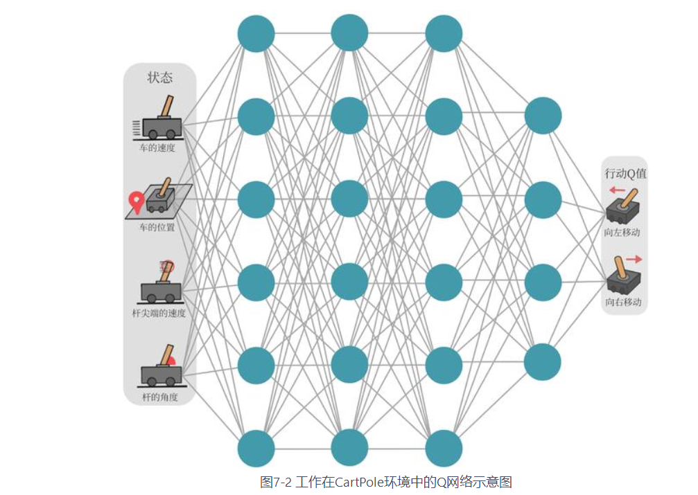
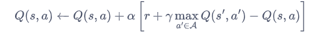
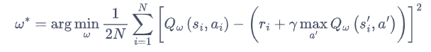
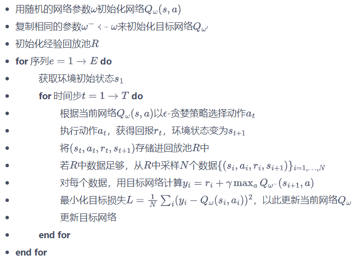
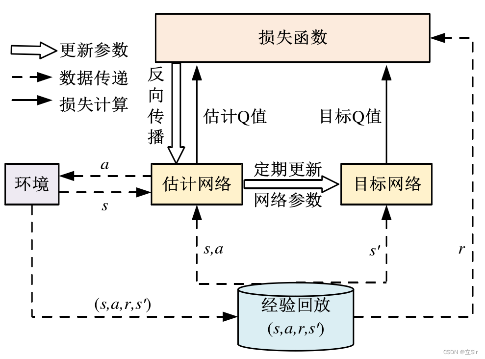
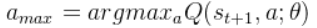
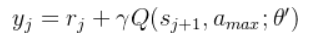
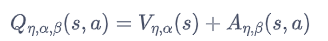
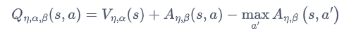
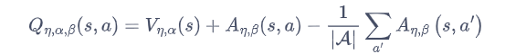

## DQN(deep Q network)算法作用：
在Q-learning等算法中，需要建立了一张存储每个状态下所有动作$Q$值的表格,这对于动作、状态数量多的环境并不适用，更无法解决动作为连续值的问题。

对于这种情况，我们需要**用函数拟合的方法来估计$Q$值**，即将这个复杂的$Q$值表格视作数据，使用一个参数化的函数$Q_{\theta}$来拟合这些数据。很显然，这种函数拟合的方法存在一定的精度损失，因此被称为近似方法。我们今天要介绍的 DQN 算法便可以用来解决**连续状态下离散动作**的问题。

## 模型架构

我们可以用一个神经网络来表示函数$Q$。
若动作是离散（有限）的，**我们可以将状态$S$输入到神经网络中，使其同时输出每一个动作的$Q$值。**

## 损失函数
在Q-learning中，我们对$Q$的更新方式如下：

故不难想到我们需要用令Q(s,a)去逼近时序差分值，将损失函数构造为均方误差形式可得：

## 训练技巧
#### 1.经验回放
在一般的有监督学习中，假设训练数据是独立同分布的，我们每次训练神经网络的时候从训练数据中随机采样一个或若干个数据来进行梯度下降，随着学习的不断进行，每一个训练数据会被使用多次。在原来的 Q-learning 算法中，每一个数据只会用来更新一次Q值。**为了更好地将 Q-learning 和深度神经网络结合**，DQN 算法采用了**经验回放**（experience replay）方法。
具体做法为维护一个**回放缓冲区**，将每次从环境中采样得到的四元组数据（状态、动作、奖励、下一状态）存储到回放缓冲区中，训练 Q 网络的时候再从回放缓冲区中随机采样若干数据来进行训练。这么做可以起到以下两个作用。

（1）**使样本满足独立假设**。在 MDP 中交互采样得到的数据本身不满足独立假设，因为这一时刻的状态和上一时刻的状态有关。非独立同分布的数据对训练神经网络有很大的影响，会使神经网络拟合到最近训练的数据上。采用经验回放可以打破样本之间的相关性，让其满足独立假设。

（2）**提高样本效率**。每一个样本可以被使用多次，十分适合深度神经网络的梯度学习。

#### 2.目标网络
由于 TD 误差目标本身就包含神经网络的输出，**因此在更新网络参数的同时目标也在不断地改变**，这非常容易造成**神经网络训练的不稳定性**。为了解决这一问题，DQN 便使用了目标网络（target network）的思想：既然训练过程中 Q 网络的不断更新会导致目标不断发生改变，不如**暂时先将 TD 目标中的 Q 网络固定住**。为了实现这一思想，我们需要利用两套 Q 网络。

**DQN 算法的具体流程如下：**

## 算法改进
#### 1.Double DQN
**Double DQN作用:**
DQN 算法通过贪婪法直接获得目标 Q 值，贪婪法通过最大化方式使 Q 值快速向可能的优化目标收敛，但易导致**过估计Q 值**的问题，使模型具有较大的偏差。DQN 算法过估计 Q 值的问题不适合机器人操作行为的研究，采用 Double DQN 算法**解耦动作的选择和目标 Q 值的计算**，以解决过估计 Q 值的问题。

**改进点：**
Double  DQN 算法不直接通过最大化的方式选取目标网络计算的所有可能 Q 值，而是首先通过**估计网络**选取**最大 Q 值对应的动作**，公式表示如下： 

然后**目标网络**根据 $a_{max}$ 计算目标 Q 值，公式表示如下：

#### 2.Dueling DQN
**Dueling DQN作用：**
Dueling DQN是一种基于DQN的改进算法，它的主要突破点在于**利用模型结构将值函数表示成更细致的形式**，使得模型能够拥有更好的表现。

在强化学习中，我们将状态动作价值函数Q减去状态价值函数V的结果定义为优势函数A，**即$A(s,a)=Q(s,a)-V(s)$**。
据此，在 Dueling DQN 中，Q 网络被建模为：

其中$\eta$是状态价值函数和优势函数共享的网络参数，一般用在神经网络中，用来提取特征的前几层；而$\alpha$和$\beta$分别为状态价值函数和优势函数的参数。
**在这样的模型下，我们不再让神经网络直接输出Q值，而是训练神经网络的最后几层的两个分支，分别输出状态价值函数和优势函数，再求和得到Q值。**
它存在对于$V$值和$A$值建模不唯一性的问题。
为了解决这一问题，Dueling DQN 可以强制最优动作的优势函数的实际输出为 0，即：

也可以通过使所有动作A值和为0来控制唯一性。

有的读者可能会问：“为什么 Dueling DQN 会比 DQN 好？”部分原因在于 Dueling DQN 能更高效学习状态价值函数。**每一次更新时，函数V都会被更新，这也会影响到其他动作的Q值**.而传统的 DQN 只会更新某个动作的Q值，其他动作的Q值就不会更新。因此，Dueling DQN 能够更加频繁、准确地学习状态价值函数。

## 学习链接
**Double DQN：** http://t.csdnimg.cn/pIUqW
**Dueling DQN：** http://t.csdnimg.cn/jlxE7