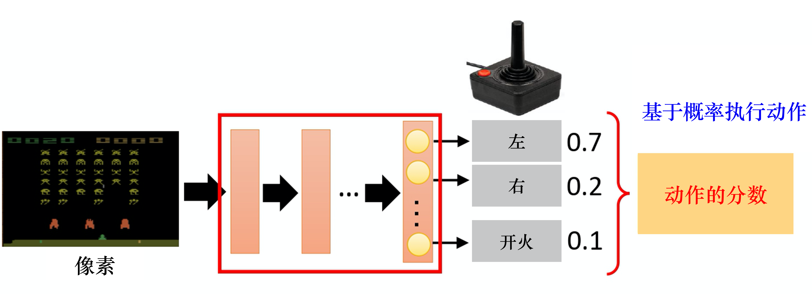
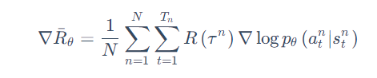
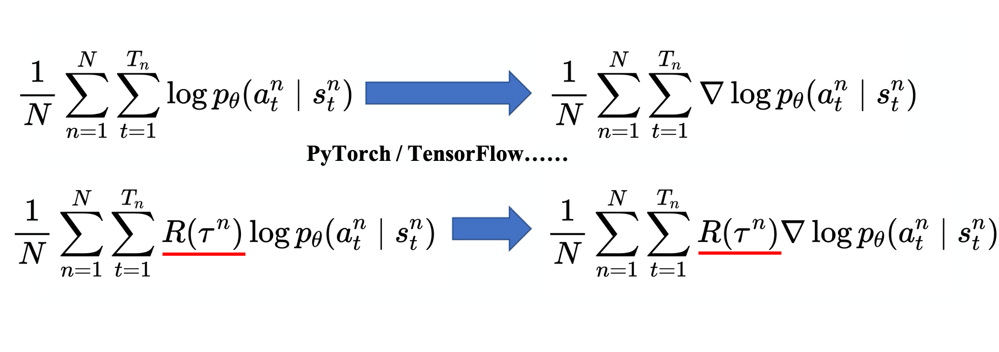
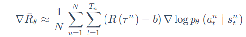
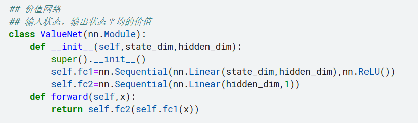
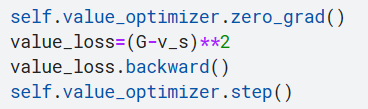
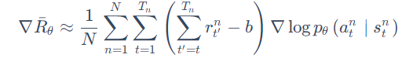
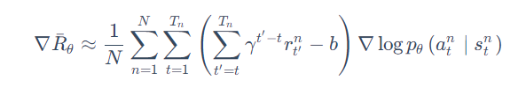

## 策略梯度算法作用
Q-learning、DQN 及 DQN 改进算法都是基于价值（value-based）的方法。在强化学习中，除了基于值函数的方法，还有一支非常经典的方法，那就是**基于策略**（policy-based）的方法。
基于策略的方法直接**显式地学习一个目标策略**，而**策略梯度**是基于策略的方法的基础。

## 策略梯度算法介绍
策略一般记作 π。假设我们使用深度学习来做强化学习，**策略就是一个网络**。网络里面有一些参数，我们用 θ 来代表 π 的参数。网络的输入是智能体看到的东西，**输出是执行每个动作的概率**。

在一场游戏里面，我们把环境输出的 s 与演员输出的动作 a 全部组合起来，就是一个轨迹，即
$$\tau=\left\{s_{1}, a_{1}, s_{2}, a_{2}, \cdots, s_{t}, a_{t}\right\}$$
给定演员的参数 θ，我们可以计算某个轨迹τ发生的概率为
$\begin{aligned} p_{\theta}(\tau) &=p\left(s_{1}\right) p_{\theta}\left(a_{1} | s_{1}\right) p\left(s_{2} | s_{1}, a_{1}\right) p_{\theta}\left(a_{2} | s_{2}\right) p\left(s_{3} | s_{2}, a_{2}\right) \cdots \\ &=p\left(s_{1}\right) \prod_{t=1}^{T} p_{\theta}\left(a_{t} | s_{t}\right) p\left(s_{t+1} | s_{t}, a_{t}\right) \end{aligned}$

在某一场游戏的某一个回合里面，我们会得到奖励$R(\tau)$。我们要做的就是调整演员内部的参数 $\theta$， 使得$R(\tau)$的值越大越好。 
给定某一组参数$ \theta$，我们可计算 $r_{\theta}$ 的期望值为
$$\bar{R}_{\theta}=\sum_{\tau} R(\tau) p_{\theta}(\tau)=E_{τ∼pθ(τ)}[R(τ)]$$
 (注意：环境在给定同样的观测时要采取什么样的动作，要产生什么样的观测，本身也是有随机性的，**所以$R(\tau)$是一个随机变量**。)

因为我们要让奖励越大越好，所以可以使用梯度上升（gradient ascent）来最大化期望奖励。
$$\nabla \bar{R}_{\theta}=\sum_{\tau} R(\tau) \nabla p_{\theta}(\tau)$$

经过化简可得到：

最终得到算法如下：

注意，一般策略梯度（policy gradient，PG）采样的数据**只会用一次**，及为**在线算法**。

## 损失函数

## 训练技巧
#### 1.添加基线
原损失函数存在一定的问题。
对于一些游戏，所有奖励都为正值，在这种情况下，所有被采样到的状态概率都会上升，而没有被采样到状态概率就会下降，这显然是有问题的。

**为了解决奖励总是正的的问题，我们可以把奖励减 b**，即

其中，bb 称为基线。通过这种方法，我们就可以让 $R(\tau)-b$这一项有正有负。如果我们得到的总奖励$R(\tau)>b$，就让 $(s,a)$ 的概率上升。如果$R(\tau)<b$，就算$R(\tau)$是正的，值很小也是不好的，我们就让$(s,a)$的概率下降，让这个状态采取这个动作的分数下降。
在具体实现中，可以使用一个状态价值网络去拟合每个状态的平均值。

损失函数使用估计价值与实际价值的平方误差

#### 2.分配合适的分数
在原损失函数中，只要在同一场游戏里面，所有的状态-动作对就使用同样的奖励项进行加权。这显然是不公平的，因为在同一场游戏里面，也许有些动作是好的，有些动作是不好的。 

一个改进做法是计算某个状态-动作对的奖励的时候，不把整场游戏得到的奖励全部加起来，**只计算从这个动作执行以后得到的奖励**。因为这场游戏在执行这个动作之前发生的事情是与执行这个动作是没有关系的，所以在执行这个动作之前得到的奖励都不能算是这个动作的贡献。我们把执行这个动作以后发生的所有奖励加起来，才是这个动作真正的贡献。
**改进后是损失函数如下**：

**接下来更进一步，我们把未来的奖励做一个折扣**：

为什么要把未来的奖励做一个折扣呢？因为虽然在某一时刻，执行某一个动作，会影响接下来所有的结果，**但在一般的情况下，时间拖得越长，该动作的影响力就越小**(折扣因子$\gamma$的实质意义)。

## 学习资源
**较容易理解的讲解：** https://datawhalechina.github.io/easy-rl/#/chapter4/chapter4
**code:** https://github1s.com/Lizhi-sjtu/DRL-code-pytorch/tree/main