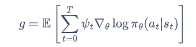
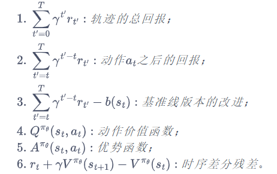
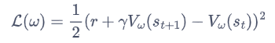
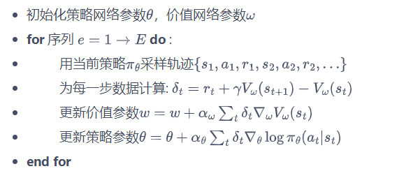
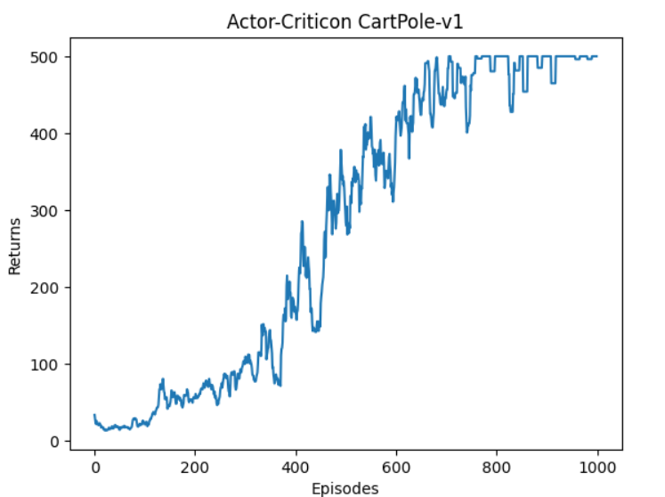

## Actor-Critic算法作用
Actor-Critic 算法本质上是基于策略的算法，因为这一系列算法的目标都是优化一个带参数的策略，只是会**额外学习价值函数**，从而帮助策略函数更好地学习。

## Actor-Critic算法介绍
在 REINFORCE 算法中，目标函数的梯度中有一项轨迹回报，用于指导策略的更新。REINFOCE 算法用蒙特卡洛方法来估计Q(s,a)，事实上也可以通过拟合一个值函数来帮助更新。

在策略梯度中，可以把梯度写成下面这个更加一般的形式：

其中，$\psi_t$可以有很多种形式：

(1),(2):在基本的Reinforce中使用的是这两个形式
(3)在BaseLine-Reinforce中使用的是这个形式。
(4)可以使用一个神经网络来估计动作价值函数
(5)如果使用状态价值函数V作为基线，从Q函数中减去V函数则得到A函数，即优势函数。
(6)在(5)的基础上，代入$Q=r+\gamma V$就得到(6)

**优点：** 事实上，用值或者值本质上也是用奖励来进行指导，但是用神经网络进行估计的方法可以**减小方差、提高鲁棒性**。除此之外，REINFORCE 算法基于蒙特卡洛采样，**只能在序列结束后进行更新**，这同时也要求任务具有有限的步数，**而 Actor-Critic 算法则可以在每一步之后都进行更新**，并且不对任务的步数做限制。

**算法过程：**
我们将 Actor-Critic 分为两个部分：**Actor**（策略网络）和 **Critic**（价值网络），如图 10-1 所示。

Actor 要做的是与环境交互，并在 Critic 价值函数的指导下用策略梯度学习一个更好的策略。
Critic **要做的是通过 Actor 与环境交互收集的数据学习一个价值函数**，这个价值函数会用于判断在当前状态什么动作是好的，什么动作不是好的，进而帮助 Actor 进行策略更新。

**损失函数：**
actor的损失函数和Reinforce类似。
critic的损失函数采取时序差分残差的学习方式，对于单个数据定义如下价值函数的损失函数：

其中$r+\gamma V_\omega(s_{t+1})$作为时序差分目标，**不会更新梯度**。

Actor-Critic 算法的具体流程如下：

## 结果

**相比Reinforce明显稳定了很多。**