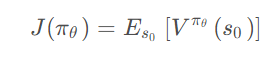

## TRPO算法作用
当策略网络是深度模型时，沿着策略梯度更新参数，很有可能由于步长太长，策略突然显著变差，进而影响训练效果。
针对该问题，我们考虑在更新时找到一块信任区域（trust region），**在这个区域上更新策略时能够得到某种策略性能的安全性保证**，这就是**信任区域策略优化**（trust region policy optimization，TRPO）算法的主要思想。

## 算法介绍
策略网络的优化目标是最大化期望奖励，即

TRPO希望在更新策略时，期望奖励不变差，即回报差大于0.

经过一些推导和近似得到下式：

其中$L_π(π^{θ′}) $表示**与旧策略相近**的新策略产生的回报。

但我们要**保证策略确实很相近**，我们明确需要一种方法，估计两个策略很相近：
TRPO使用KL散度衡量整体的优化公式：约束KL散度即可将其限制在一定距离内

此时带约束的优化问题表示如下：

**即我们要在满足KL散度约束的条件下，最大化期望奖励。**

TRPO算法流程如下：

## 结果

**训练过程明显稳定许多**

## 学习资源
**公式推导：** http://t.csdnimg.cn/YXIc9
**论文解读：** http://t.csdnimg.cn/d09HS
**简要介绍：** http://t.csdnimg.cn/P3a1i
