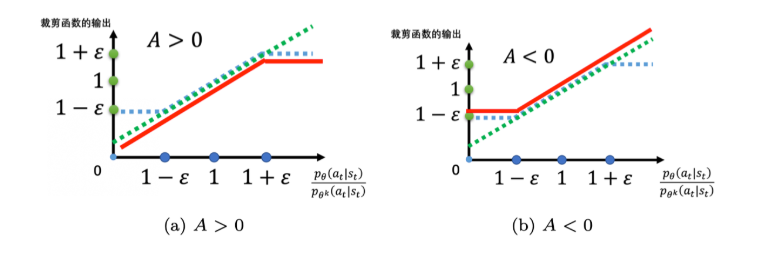

## PPO算法作用
PPO 基于 TRPO 的思想，但是其算法**实现更加简单**。并且大量的实验结果表明，与 TRPO 相比，**PPO效果一样好**（甚至更快）。

## PPO算法介绍
在TRPO中，算法的优化目标如下：

**在PPO1中，** 算法的优化目标改为：

其中：

**即将作为约束项的KL散度直接加入为损失函数的项**。

**自适应KL散度：** 对于$\beta$的值，PPO1中采用自适应的方法确定。
我们先设一个可以接受的 KL 散度的最大值，假设优化完式(5.7)以后，KL 散度的值太大，这就代表后面惩罚的项没有发挥作用，我们就把 $\beta$增大。另外，我们设一个 KL 散度的最小值。如果优化完损失函数以后，KL 散度比最小值还要小，就代表后面这一项的效果太强了，我们怕他只优化后一项，使$\theta$ 与 $\theta^k$一样，这不是我们想要的，所以我们要减小 $\beta$。

具体更新规则如下：

**在PPO2中，** 采用另一种方式来控制$\theta$ 与 $\theta^k$的差距不会太大，其目标函数是：

其中，第二项前面有一个裁剪（clip）函数，裁剪函数是指，在括号里面有3项，如果第一项小于第二项，那就输出$1-\varepsilon$；第一项如果大于第三项，那就输出 $1+\varepsilon$。
$\varepsilon$是一个超参数，是我们要调整的，可以设置成 0.1 或 0.2 。

**如果 $A > 0$，也就是某一个状态-动作对是好的，我们希望增大这个状态-动作对的概率,但为了避免两个策略差距过大，采用两个概率的比值不超过$1+\varepsilon$。**
**如果 $A < 0$，也就是某一个状态-动作对是不好的，我们希望减少这个状态-动作对的概率,但为了避免两个策略差距过大，采用两个概率的比值小于$1-\varepsilon$。**

优势函数 $\hat{A}_t$ 使用 **GAE（generalized advantage estimation）** 来计算：

OpenAI 研究团队实验论证，**PPO- Clip 比 PPO- Penalty有更好的数据效率和可行性。**

## 结果
**PPO-clip:**

**PPO-penalty:**

**PPO-clip明显比PPO-penalty更加稳定，且不需要调整超参数。**

## 学习资源：
**李宏毅强化学习课程：** https://www.bilibili.com/video/BV1F4411c7og/?p=3&share_source=copy_web&vd_source=2b8655e2bed7b94d772fed5f5a577565
**论文解读：** http://t.csdnimg.cn/EujpC
**详细介绍：** http://t.csdnimg.cn/tjtrc
**PPO-penalty代码：**https://github1s.com/ChengTsang/PPO-clip-and-PPO-penalty-on-Atari-Domain/blob/master/PPO_penalty/ppo_penalty.py 