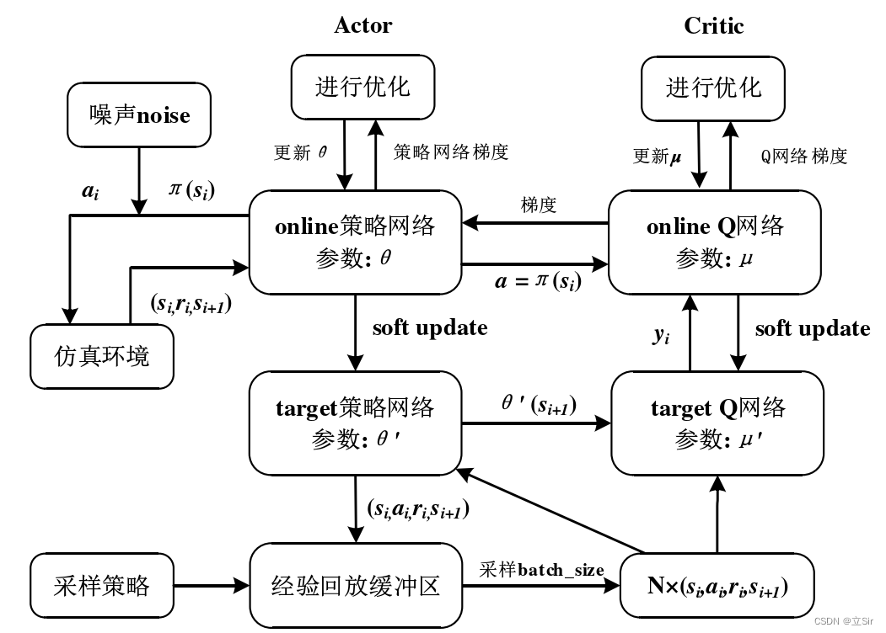
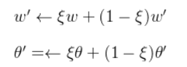
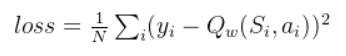
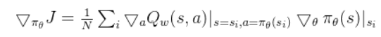
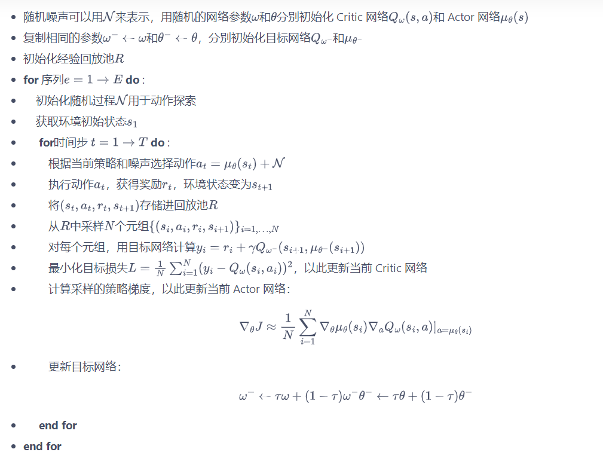
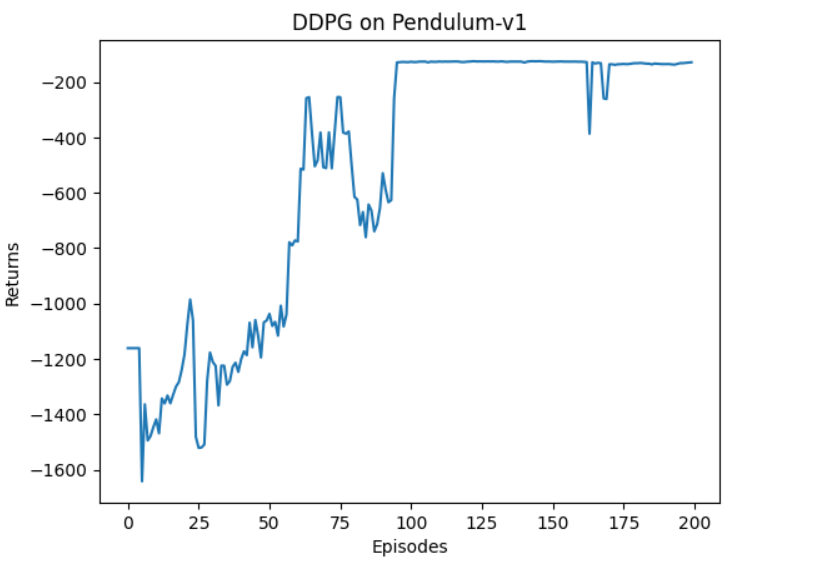

## DDPG(Deep Deterministic Policy Gradient)作用：
DDPG能够处理**动作空间无限**的环境并且使用的是**离线策略算法。**

## DDPG算法介绍

**算法特点：**

DDPG 算法架构中使用双重神经网络架构，对于策略函数和价值函数均使用双重神经网络模型架构（即 **Online 网络和 Target 网络**）
目标网络是Q网络和策略网络的一个延迟版本，它们的参数定期从原始网络通过**soft update**的方式更新。这样，即使原始网络的参数在不断变化，目标网络的参数也保持相对稳定，从而减少了目标值的波动。因此，DDPG可以使用任何策略下的数据来更新原始网络，而不会导致不稳定的学习 。

DDPG 通过soft update机制（每次 learn 的时候更新部分参数）保证参数可以缓慢更新，从而提高学习的稳定性：

DDPG是离线策略算法，**DDPG不需要遵循当前的策略来生成数据，是因为它使用了一个目标网络来给出一致的目标值。**

DDPG是确定性策略算法，策略网络的输出是确定性的，需要**引入随机噪声**来进行探索。

## 损失函数
critic网络的损失函数：

其中，$a_i = \pi _{\theta} (S_i) + \varepsilon，\varepsilon$ 代表行为策略上的**探索噪声**。
actor网络的损失函数：

**算法流程：**

### 改进算法：TD3

## 结果

**需要的样本量很少，效果较好，但对超参数比较敏感。**

## 学习资源
**详细的介绍：** http://t.csdnimg.cn/1uzJ8
