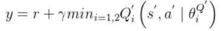
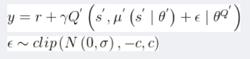
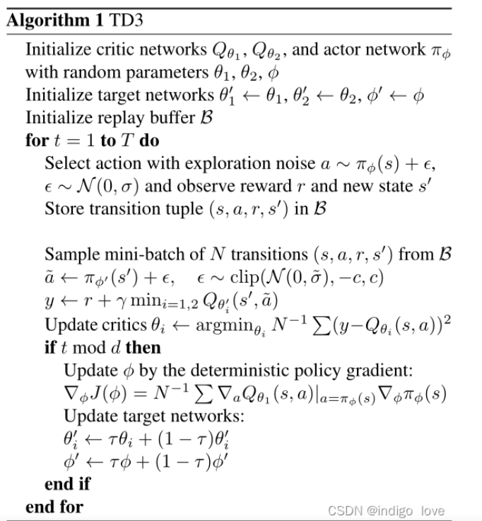
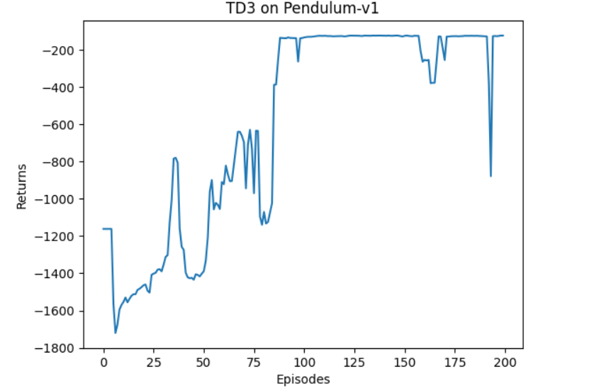

## TD3算法作用：
TD3算法是Deep Deterministic Policy Gradient（DDPG）算法的改进，它通过增加两个额外的目标策略网络，并使用两个不同的策略网络来更新策略，从而解决DDPG算法的**高估问题**，并提高了算法的**稳定性**。

## TD3算法原理：
TD3算法在DDPG算法的基础上，提出了三个关键技术：

（1）**双重网络** (Double network)：采用两套Critic网络，计算目标值时取二者中的较小值，从而抑制网络过估计问题。

（2）**目标策略平滑正则化** (Target policy smoothing regularization)：计算目标值时，在下一个状态的动作上加入扰动，从而使得价值评估更准确。

（3）**延迟更新** (Delayed update)：Critic网络更新多次后，再更新Actor网络，从而保证Actor网络的训练更加稳定。

### 双重网络
每次采样状态动作对$\left ( s,a \right )$来对Critic网络进行更新时，就会让网络高估$\left ( s,a \right )$的状态动作价值，而$\left ( s,a \right )$在经验池中的频率显然是不均匀的。如果出现的频率越高，那么高估就越严重。因此，网络的高估是非均匀的，而非均匀的高估对智能体的决策有害，因此我们需要避免网络高估。

**训练Critic网络时最大化操作会使得网络的估计值大于真实值，从而造成网络过估计。**
**双重网络是解决最大化问题的有效方法**。在TD3算法中，作者引入了两套相同网络架构的Critic网络。计算目标值时，会利用二者间的**较小值**来估计下一个状态动作对$\left ( s^{'},a^{'} \right )$的状态动作价值，即

### 目标策略平滑正则化
确定性策略存在一个问题：**它会过度拟合以缩小价值估计中的峰值。**
当更新Critic网络时，使用确定性策略的学习目标极易受到函数逼近误差的影响，从而导致目标估计的**方差大**，估计值不准确。这种诱导方差可以通过**正则化**来减少，因此作者模仿SARSA的学习更新，引入了一种深度价值学习的正则化策略——目标策略平滑。

这种方法主要强调：**类似的行动应该具有类似的价值**。虽然函数近似隐式地实现了这一点，但可以通过修改训练过程显示地强调类似动作之间的关系。**具体的实现是利用目标动作周围的区域来计算目标值，从而有利于平滑估计值**。

**在实际操作时，我们可以通过向目标动作中添加少量随机噪声，并在小批量中求平均值，来近似动作的期望。**

### 延迟更新
这里的延迟更新指的是**Actor网络的延迟更新**，即Critic网络更新多次之后再对Actor网络进行更新。这个想法其实是非常直观的，因为Actor网络是通过最大化累积期望回报来更新的，**它需要利用Critic网络来进行评估。**如果Critic网络非常不稳定，那么Actor网络自然也会出现震荡。

因此，我们可以让Critic网络的更新频率高于Actor网络，即**等待Critic网络更加稳定**之后再来帮助Actor网络更新。

**TD3算法流程：**

## 结果

## 学习资源
**TD3介绍：** http://t.csdnimg.cn/vfqyD
**TD3代码：** https://github.com/sfujim/TD3