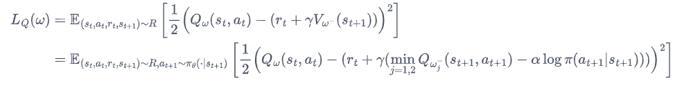
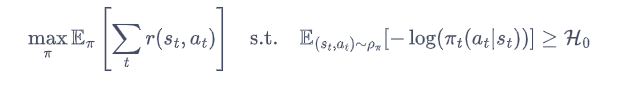

## SAC算法作用
虽然 DDPG 是离线策略算法，但是它的训练非常不稳定，收敛性较差，对超参数比较敏感，也难以适应不同的复杂环境。而SAC则是一个更加稳定的离线策略算法。
SAC 算法在以最大化未来累积奖励的基础上引入了最大熵的概念，加入熵的目的是**增强鲁棒性和智能体的探索能力**，使得智能体能够在复杂的环境中探索到更多的可能性，从而使未来累积奖励值和熵最大化，
## SAC算法介绍
### 最大熵学习
除了考虑最大化累积奖励，还考虑不确定度，使得策略更加随机。

其中第二项即为熵，也可视为正则项。$\alpha$是一个正则化的系数，用来控制熵的重要程度。

熵的计算公式为：

### Soft 策略迭代
在最大熵强化学习框架中，由于目标函数发生了变化，其他的一些定义也有相应的变化。

**Soft 贝尔曼方程:**

**状态价值函数：**

**策略提升公式：**

根据该 Soft 贝尔曼方程，在有限的状态和动作空间情况下，Soft 策略评估可以收敛到策略的 Soft 函数。根据 Soft 策略提升公式可以改进策略。

### SAC
#### 双重Q网络
和TD3一样，SAC也使用2个Q网络，然后取最小值来缓解过估计问题。
**Q网络的损失函数：**

#### 策略网络
策略$\pi$的损失函数由 KL 散度得到，化简后为：

**重参数化技巧：**
对连续动作空间的环境，SAC 算法的策略**输出高斯分布的均值和标准差**，但是根据高斯分布来采样动作的过程是不可导的。因此，我们需要用到重参数化技巧（reparameterization trick）。重参数化的做法是**先从一个单位高斯分布采样**，**再把采样值乘以标准差后加上均值**。这样就可以认为是从策略高斯分布采样，并且这样对于策略函数是可导的。

#### 自动调整正则项
在最优动作不确定的某个状态下，熵的取值应该大一点；而在某个最优动作比较确定的状态下，熵的取值可以小一点。为了自动调整熵正则项，SAC 将强化学习的目标改写为一个带约束的优化问题：

**即约束熵的均值大于某个事先确定的超参数$H_0$.**
故得到$\alpha$的**损失函数**：

**即当策略的熵低于目标值$H_0$时，训练目标$L(\alpha)$会使$\alpha$的值增大，进而在上述最小化损失函数$L_{\pi}(\alpha)$的过程中增加了策略熵对应项的重要性；而当策略的熵高于目标值$H_0$时，训练目标$L(\alpha)$会使$\alpha$的值减小，进而使得策略训练时更专注于价值提升**。

### 算法流程

## 结果：
连续型：

**模型在离散环境效果很好。**
离散型：

**收敛速度较慢**

## 学习资源
### Soft-Qlearning:
**论文解读**： http://t.csdnimg.cn/yo1NC
**详细介绍**：https://zhuanlan.zhihu.com/p/149091823
**代码实现**:https://github1s.com/xuxie1031/SoftQLearning/blob/HEAD/SoftQAgent.py

### SAC：
**论文解读**：https://zhuanlan.zhihu.com/p/70360272
**容易理解的介绍**：http://t.csdnimg.cn/XkqW7
**简要清晰的介绍**：http://t.csdnimg.cn/2WehI
**资源整理**： http://t.csdnimg.cn/23vZP
