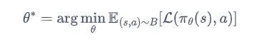
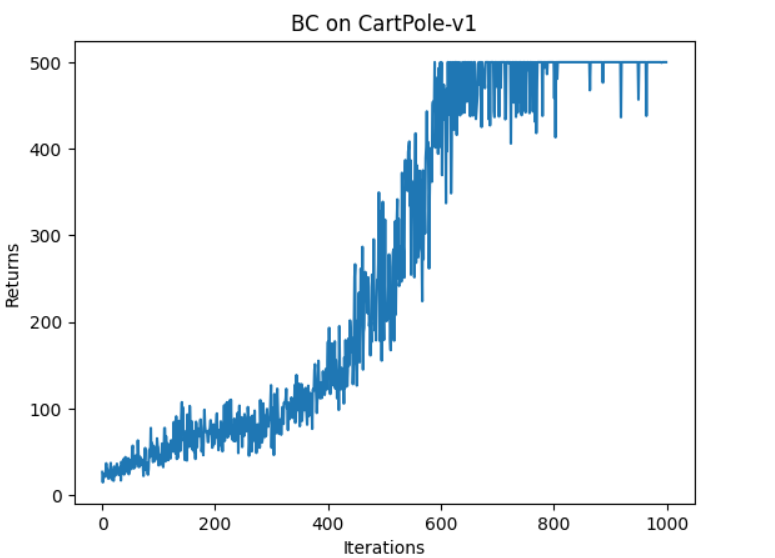

## 模仿学习作用
虽然强化学习不需要有监督学习中的标签数据，但它十分依赖**奖励函数的设置**。有时在奖励函数上做一些微小的改动，训练出来的策略就会有天差地别。在很多现实场景中，奖励函数并**未给定**，或者**奖励信号极其稀疏**，此时随机设计奖励函数将无法保证强化学习训练出来的策略满足实际需要。
假设存在一个**专家智能体**，其策略可以看成最优策略，我们就可以**直接模仿这个专家在环境中交互的状态动作数据**来训练一个策略，并且**不需要用到环境提供的奖励信号**。

## 模仿学习算法
模仿学习（imitation learning）研究的便是这一类问题，**在模仿学习的框架下，专家能够提供一系列状态动作对$\{(s_i,a_i)\}$，表示专家在环境$s_i$下做出了的动作$a_i$，而模仿者的任务则是利用这些专家数据进行训练，无须奖励信号就可以达到一个接近专家的策略。** 目前学术界模仿学习的方法基本上可以分为 3 类：
(1)**行为克隆**（behavior cloning，BC）
(2)**逆强化学习**（inverse reinforcement learning，IRL）
(3)**生成式对抗模仿学习**（generative adversarial imitation learning，GAIL）

## 行为克隆（BC）
行为克隆（BC）就是直接使用监督学习方法，将专家数据$(s_i,a_i)$中的$s_i$看作样本输入，$a_i$视为标签，学习的目标为

其中，$B$是专家的数据集，$L$是对应监督学习框架下的损失函数。**若动作是离散的，该损失函数可以是最大似然估计得到的。若动作是连续的，该损失函数可以是均方误差函数。**

### 优点
在训练数据量比较大的时候，BC 能够很快地学习到一个不错的策略。
BC 能使得策略无须在较差时仍然低效地通过和环境交互来探索较好的动作，而是通过模仿专家智能体的行为数据来快速达到较高水平，为接下来的强化学习创造一个高起点。故在很多实际场景下它都可以作为**策略预训练的方法**。

### 缺点
**需要大量专家数据**。另外，只要存在一点偏差，就有可能导致下一个遇到的状态是在专家数据中没有见过的，导致**复合误差**的产生。

## 结果：

在简单环境中效果很好。
