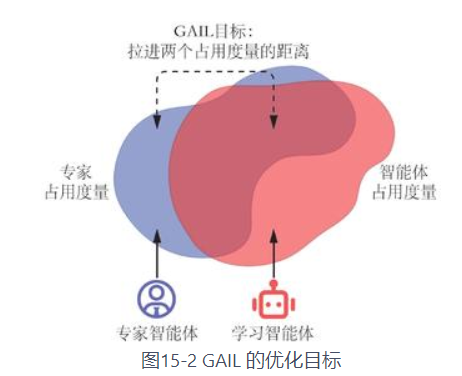
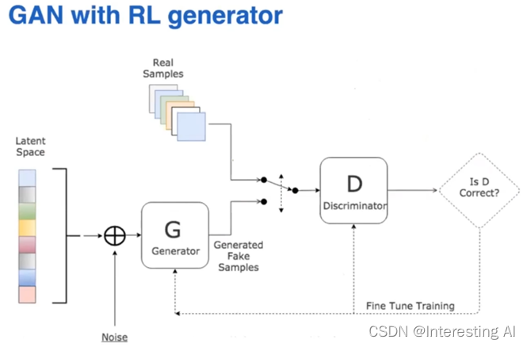
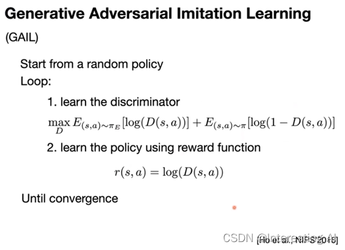
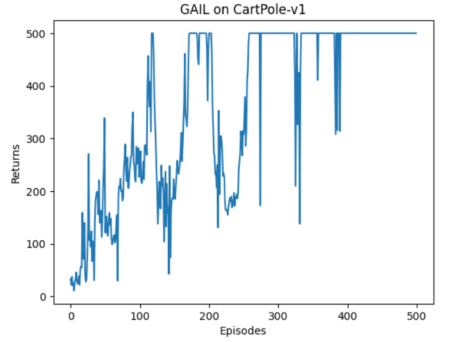

## 生成式对抗模仿学习 (GAIL)
GAIL 实质上是模仿了专家策略的占用度量$\rho_E(s,a)$，即尽量使得策略在环境中的所有状态动作对$(s,a)$的占用度量$\rho_{\pi}(s,a)$和专家策略的占用度量$\rho_E(s,a)$一致。

**模型架构**：

**算法过程**：

## 损失函数
**判别器损失**：即判别损失
**策略网络损失**：根据将判别器输出区log作为rewards,然后按策略模型的更新方式进行更新。(**生成器起到了生成样本rewards的作用，这对于一些难以计算奖励函数的复杂环境很有帮助**)
**策略网络可以使用PPO，A2C等在线策略。**

## 结果

训练效果不错，但训练过程比较**不稳定**。

## 学习资源
**详细介绍**： http://t.csdnimg.cn/YEUc1

**代码实现**： https://github.com/openai/imitation
