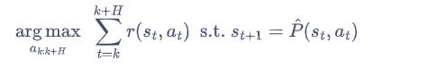
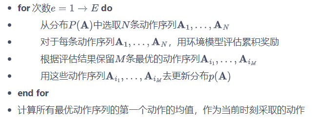

## 模型预测控制作用
模型预测控制（model predictive control，MPC）算法并不构建一个显式的策略，只根据环境模型来选择当前步要采取的动作。

## MPC算法
MPC算法通过预测未来状态，然后选择一个最优的控制策略，来控制系统的状态。

### 打靶法
每次采取动作时，首先会**生成一些候选动作序列，然后根据当前状态来确定每一条候选序列能得到多好的结果，最终选择结果最好的那条动作序列的第一个动作来执行**。因此，在使用 MPC 方法时，主要在两个过程中迭代，一是根据历史数据学习环境模型，二是在和真实环境交互过程中用环境模型来选择动作。

其中$H$为**推演的长度**，$argmax_{a_{k:k+H}}$表示从所有动作序列中选取累积奖励最大的序列。

### 随机打靶法
随机打靶法（random shooting method）的做法便是**随机生成$N$条动作序列**，即在生成每条动作序列的每一个动作时，都是从动作空间中随机采样一个动作，最终组合成$N$条长度为$H$的动作序列。然后，根据每条动作序列的奖励，选择累积奖励最大的动作序列。

## 交叉熵方法
交叉熵方法（cross entropy method，**CEM**）是一种进化策略方法，它的核心思想是维护一个带参数的分布，**根据每次采样的结果来更新分布中的参数，使得分布中能获得较高累积奖励的动作序列的概率比较高**。相比于随机打靶法，交叉熵方法能够利用之前采样到的比较好的结果，在一定程度上**减少采样到一些较差动作的概率**，从而使得算法更加高效。对于一个与连续动作交互的环境来说，每次交互时交叉熵方法的做法如下：

